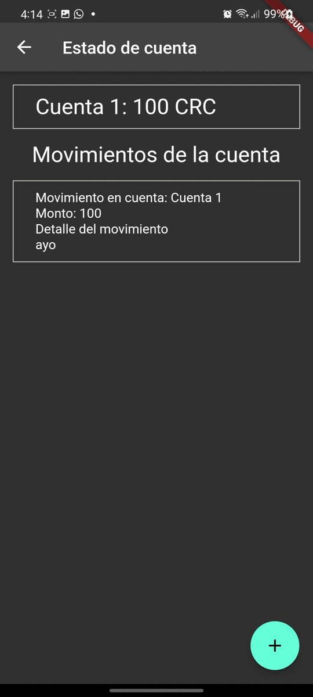
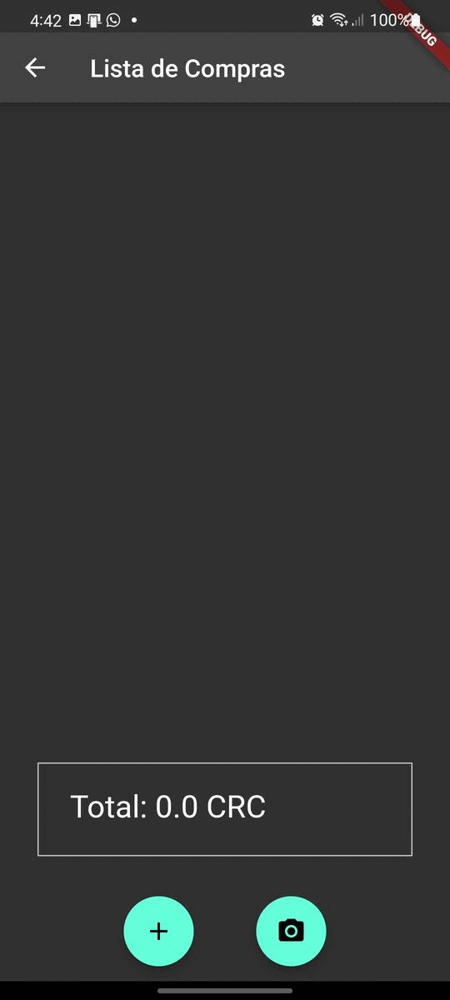
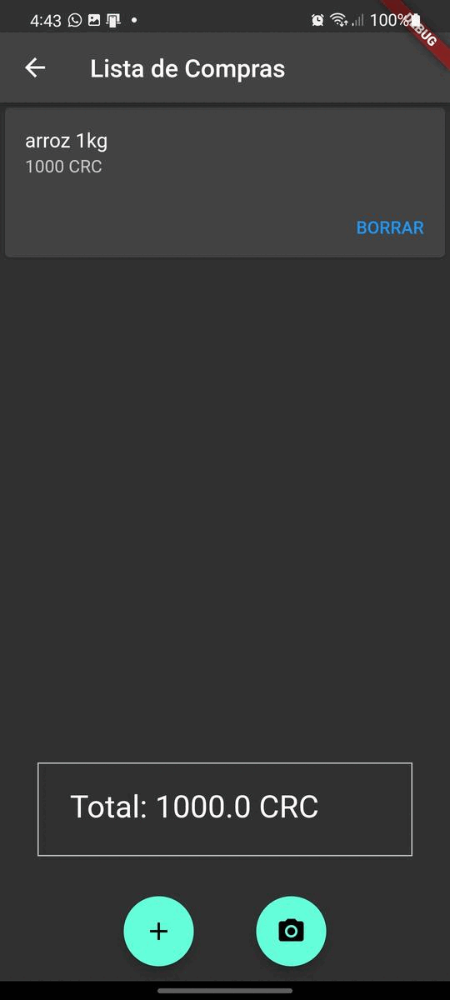

# Asistente financiero para personas con discapacidad visual

Un prototipo de aplicación móvil con funcionalidades financieras accesibles y útiles para la población en condición de discapacidad visual.

## Funcionalidades

Este prototipo cuenta con las siguientes funcionalidades:

### Autenticación de usuario biométrica

Debido a la naturaleza de la información manejada por esta aplicación se implementó una etapa de autenticación por huella dactilar

### Manejo de estados de cuenta

La pantalla inicial, presenta al usuario con su estado de cuenta y le permite a este agregar movimientos de forma manual.

### Lista de compras

En la pantalla de lista de compras el usuario puede agregar elementos a la lista, junto con su precio para obtener un rápido cálculo del total.

### Capacidad de lectura QR

En la misma pantalla de lista de compras, se pueden agregar elementos a esta por medio de un código QR que contiene la información codificada de el producto escaneado.

